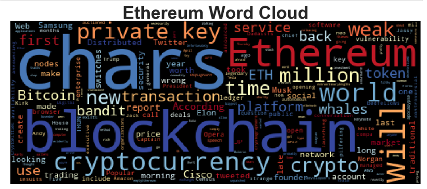

# Unit 12—Tales from the Crypto

#### Sentiment Analysis

Use the [newsapi](https://newsapi.org/) to pull the latest news articles for Bitcoin and Ethereum and create a DataFrame of sentiment scores for each coin.

Use descriptive statistics to answer the following questions:

> Which coin had the highest mean positive score?
> BITCOIN
> Which coin had the highest negative score?
> BITCOIN
> Which coin had the highest positive score?
> ETHEREUM

Furthermore, Sentiments on Ethereum are more volatile than those for Bitcoin. The standard deviations are higher on Ethereum scores for compound, negative, neutral and positive texts.

#### Natural Language Processing

 In order to analyze sentiments and tones further, texts in articles are tokenized by applying NLTK and Regex to tokenize the text for each coin.

1. Lowercase each word
2. Remove punctuation
3. Remove stop words

Next, look at the ngrams and word frequency for each coin.

For each coin, we create dataframes for ten most popular bigrams and words based on frequencies of appearance. The table below summarizes top 10 most commonly used pairs and single words for bitcoin and ethereum.

Bitcoin gets its attention based on people especially for its inventor. The tone gears towards casual embracement based on specific words that frequently appeared. Ethereum grabs writers' attention during certain time periods. Besides, ethereum is compared to bitcoin often. The popular words and two-word combinations on ethereum convey a sense of mixed emotions. The result is consistent with our conclusion in the previous sentiment analysis that bitcoin gains a higher positive score on average.

#### Named Entity Recognition

Entity tags are color coded in SpaCy for texts on each coin. Based on the models, more organizations including Apple and Visa are tagged for ethereum, possibly for its application on debit card in the above bigram analysis. Bitcoin, on the other hand, brand itself like a celebrity for its creator Satoshi Nakaboto and being Bitcoin itself.

Labeled entity lists are generated for further analysis. According to the printed results, articles on bitcoin have been rendered more promptly than ethereums. It has more reviews written in the past 24 hours tagged under TIME. Please click on "Details" to view below.

---

